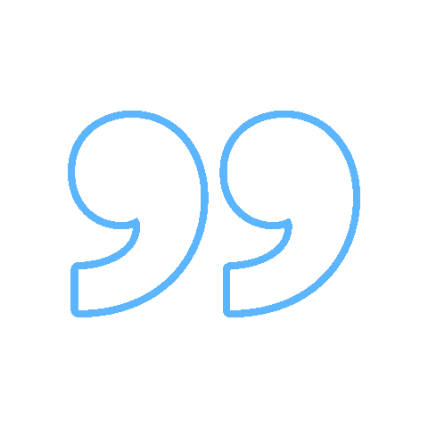

#  About Me 
💻 I'm Mahmoud, a Software Engineering Student.   
🐍 Python is my preferred programming language.  
📊 I recently started exploring the world of Data Science. 
🌠 In my spare time, I work on various projects, including full-stack development projects.

#  Tech Stack & Tools 
<a href="https://skillicons.dev">
    

        <h3>Languages</h3>
        
    

    

        <h3>Web Development</h3>
        
    

    

        <h3>Frameworks & Databases</h3>
        
    

    

        <h3>Tools</h3>
        
    

</a>
 

#  Socials 

